class: center, middle

# Lessons from a Dev Image Journey

???

In this story, there will be pain, joy, despair and hope.

It is my hope that at the end, you can take away the lessons I've learned and
apply them to your own life.

---

name: map
class: center
copy-paste-class: active
disillusion-class: active
farmer-class: active
bright-eyed-class: active
wise-class: active
devops-class: active
cards-class: active
neat-freak-class: active
whales-class: active
question-class: active

<svg
   xmlns:dc="http://purl.org/dc/elements/1.1/"
   xmlns:cc="http://creativecommons.org/ns#"
   xmlns:rdf="http://www.w3.org/1999/02/22-rdf-syntax-ns#"
   xmlns:svg="http://www.w3.org/2000/svg"
   xmlns="http://www.w3.org/2000/svg"
   xmlns:sodipodi="http://sodipodi.sourceforge.net/DTD/sodipodi-0.dtd"
   xmlns:inkscape="http://www.inkscape.org/namespaces/inkscape"
   viewBox="-10 -20 460.15749 400"
   id="journey"
   version="1.1"
   inkscape:version="0.91 r13725"
   sodipodi:docname="map.svg">
  <sodipodi:namedview
     id="base"
     pagecolor="#ffffff"
     bordercolor="#666666"
     borderopacity="1.0"
     inkscape:pageopacity="0.0"
     inkscape:pageshadow="2"
     inkscape:document-units="px"
     inkscape:current-layer="layer1"
     showgrid="false"
     showguides="true"
     fit-margin-top="0"
     fit-margin-left="0"
     fit-margin-right="0"
     fit-margin-bottom="0"
     inkscape:window-width="1276"
     inkscape:window-height="755"
     inkscape:window-x="0"
     inkscape:window-y="1"
     inkscape:window-maximized="1" />
  <metadata
     id="metadata7">
    <rdf:RDF>
      <cc:Work
         rdf:about="">
        <dc:format>image/svg+xml</dc:format>
        <dc:type
           rdf:resource="http://purl.org/dc/dcmitype/StillImage" />
        <dc:title />
      </cc:Work>
    </rdf:RDF>
  </metadata>
  <style>
  .inactive {
    fill-opacity:0;
    stroke-opacity:0.4;
  }

  .past {
    fill-opacity:0.1;
    stroke-opacity:0.4;
  }

  .relay-point {
    stroke:rgb(12,7,70);
    fill:none;
    stroke-width:10;
    stroke-linecap:round;
  }

  .note {
    fill:rgb(47,48,80);
    font-weight:500;
    font-size:38px;
    font-family:'Baoli SC';
    -inkscape-font-specification:'Baoli SC Medium';
    letter-spacing:-3px;
    text-anchor:middle;
  }

  g.active > .relay-point {
    stroke-opacity:1;
  }

  g.active > .note {
    fill-opacity:1;
  }

  rgb(246,231,176);
  </style>
  <g
     class="inactive"
     inkscape:label="Layer 1"
     inkscape:groupmode="layer"
     id="layer1"
     transform="translate(0,-90),scale(1,0.8)">
    <path
       style="fill:none;fill-rule:evenodd;stroke:#393939;stroke-width:6;stroke-linecap:round;stroke-linejoin:round;stroke-miterlimit:0;stroke-dasharray:18, 18;stroke-dashoffset:4.19999981;stroke-opacity:1"
       d="m 19.192895,259.39245 c 19.142501,-27.00721 13.332306,44.24406 63.789975,41.79151 50.45767,-2.45254 2.015859,126.13347 86.20798,121.3788 20.45766,-1.15533 -20.7378,-120.12276 14.62347,-136.99006 35.36128,-16.8673 12.18789,-29.68105 29.65438,-36.50772 37.16448,15.90177 56.03261,-54.10817 83.50408,-51.95654 27.47148,2.15164 -24.42293,83.40501 -7.87056,82.19308 15.34632,-1.12361 43.20692,67.3942 67.3794,71.00458 24.17248,3.61038 14.37024,-146.05412 46.64929,-116.40693"
       id="path3340"
       inkscape:connector-curvature="0"
       sodipodi:nodetypes="czszczssc" />
    <g
       class="{{ copy-paste-class }}"
       id="copy-paste">
      <path
         class="relay-point"
         inkscape:connector-curvature="0"
         id="path4239"
         d="m 16.644321,264.79115 c 0.990166,1.91498 4.289595,-0.0466 3.036906,-1.83917 -1.65228,-1.59621 -2.968753,0.89498 -3.523044,2.23204 -0.669383,1.7414 -2.3063,3.05181 -2.595676,4.91767 0.586963,1.57295 0.982895,-1.10919 1.566592,-1.26994"
         />
      <text
         class='note'
         transform="matrix(0.73430812,-0.22465213,0.63152954,1.1686178,0,0)"
         sodipodi:linespacing="50%"
         id="text5782"
         y="173"
         x="-62"
         xml:space="preserve"><tspan
           id="tspan5788"
           y="173"
           x="-65"
           sodipodi:role="line">copy paste</tspan><tspan
           id="tspan5792"
           y="192"
           x="-65"
           sodipodi:role="line">expert</tspan><tspan
           id="tspan5786"
           y="211"
           x="-62"
           sodipodi:role="line" /></text>
    </g>
    <g
       class="{{ disillusion-class }}"
       id="disillusion">
      <path
         class="relay-point"
         inkscape:connector-curvature="0"
         id="path4241"
         d="m 75.609526,300.38368 c -1.010152,0.50507 -2.111439,0.85878 -3.030457,1.51523 -0.03293,0.0235 -1.458265,2.85956 -1.515229,3.03045 -0.108375,0.32513 -0.0745,1.51523 0.505076,1.51523 2.072483,0 3.42745,-2.69166 4.04061,-4.04061 0.27867,-0.61307 -0.236459,-1.38975 0,-2.0203 0.615175,-1.64047 2.020305,-1.73132 2.020305,-3.53554 0,-0.16836 -0.421547,-0.14617 -0.505076,0 -0.63614,1.11325 -0.714256,2.53432 -1.515229,3.53554 -0.613258,0.76657 -1.878932,0.77643 -2.525381,1.51523 -0.523785,0.59861 -1.36003,3.61449 -1.515229,4.54568 -0.05536,0.33214 0,0.67344 0,1.01015 0,0.16836 -0.150585,0.42979 0,0.50508 0.301169,0.15059 0.676819,0.0476 1.010153,0 3.74631,-0.53519 1.844066,-0.18006 5.050762,-3.03046 5.831401,-5.18346 -1.323881,1.82896 3.535534,-3.03045 0.168359,-0.16836 0.398597,-0.29212 0.505077,-0.50508 0.07529,-0.15059 -0.168359,-0.50508 0,-0.50508 0.168358,0 0.101015,0.37039 0,0.50508 -0.428572,0.57143 -1.160844,0.89505 -1.515229,1.51523 -0.344401,0.6027 -0.314376,1.35285 -0.505077,2.0203 -0.611555,2.14045 -0.505076,0.78944 -0.505076,2.52538 0,0.16836 0,0.33672 0,0.50508 0,0.16836 -0.119047,0.38603 0,0.50508 0.119048,0.11904 0.505076,-0.16836 0.505076,0 0,0.16836 -0.386028,-0.11905 -0.505076,0 -0.266198,0.2662 -0.365262,0.66061 -0.505076,1.01015 -0.640821,1.60205 -0.505076,2.00504 -0.505076,3.53553"
         />
      <text
         class="note"
         transform="matrix(0.73037317,-0.19849374,0.22288375,1.3085899,0,0)"
         sodipodi:linespacing="125%"
         id="text5794"
         xml:space="preserve"><tspan
           id="tspan5798"
           y="223"
           x="80"
           sodipodi:role="line">frustration</tspan></text>
    </g>
    <g
       class="{{ bright-eyed-class }}"
       id="bright-eyed"
       transform="matrix(0.70829974,0,0,0.6602966,47.32759,99.003886)">
      <path
         class="relay-point"
         sodipodi:nodetypes="cccsccssscscsccccsssscssssc"
         inkscape:connector-curvature="0"
         id="path4245"
         d="m 178.43632,286.64338 -1.58482,2.33459 0,4.04061 0,1.01015 c 0,0.33672 -0.15058,0.70898 0,1.01015 0.0753,0.15059 0.34175,0.0408 0.50508,0 1.76226,-0.44056 1.96141,-0.70853 3.53553,-2.0203 0.36582,-0.30485 0.7972,-0.58424 1.01016,-1.01016 1.11663,-2.23326 1.01015,-2.31877 1.01015,-4.04061 0,-0.33671 0.15058,-0.70898 0,-1.01015 -0.0753,-0.15058 -0.33672,0 -0.50508,0 -0.50507,0 -1.01996,-0.099 -1.51523,0 -1.21252,0.24251 -2.01535,1.63283 -2.52538,2.52538 -0.26414,0.46225 -0.30735,1.02091 -0.50508,1.51523 -0.13981,0.34954 -0.41377,0.64493 -0.50507,1.01015 -0.0817,0.32667 -0.30117,1.16074 0,1.01016 1.13288,-0.56644 1.72853,-4.02957 2.0203,-5.05077 0.0817,-0.28591 0.72953,-1.79585 0.50508,-2.0203 -0.11905,-0.11905 -0.33672,0 -0.50508,0 -0.50507,0 -1.09498,-0.28017 -1.51523,0 -0.28016,0.18678 0,0.67343 0,1.01015 0,0.1225 -0.0162,1.49899 0,1.51523 0.11905,0.11905 0.33672,0 0.50508,0 0.80017,0 1.36465,0.15059 2.02031,-0.50508 0.65566,-0.65566 0.50507,-1.22013 0.50507,-2.0203 0,-0.54758 0.2381,-1.26751 -0.50507,-1.51523 -0.31944,-0.10648 -0.67344,0 -1.01016,0"
         />
      <text
         class="note"
         transform="matrix(0.87541305,0.48337562,-0.48337562,0.87541305,0,0)"
         sodipodi:linespacing="52.999997%"
         id="text5818"
         xml:space="preserve"><tspan
           id="tspan5822"
           y="189"
           x="350"
           sodipodi:role="line">heart</tspan><tspan
           id="tspan5826"
           y="210"
           x="350"
           sodipodi:role="line">eyes</tspan></text>
    </g>
    <g
       class="{{ wise-class }}">
      <path
         class="relay-point"
         inkscape:connector-curvature="0"
         id="path4247"
         d="m 210.74324,245.37152 c 0,1.68359 0,3.36718 0,5.05077 0,0.67343 0,1.34687 0,2.0203 0,0.33672 0,0.67344 0,1.01016 0,0.16835 -0.11905,0.38602 0,0.50507 0.11904,0.11905 0.33671,0 0.50507,0 0.68289,0 1.49578,0.15059 2.02031,-0.50507 0.47034,-0.58794 0.80331,-1.29636 1.01015,-2.02031 0.13875,-0.48564 0,-1.01015 0,-1.51523 0,-0.67343 0.11071,-1.35603 0,-2.0203 -0.23358,-1.40148 -2.49808,-2.69829 -3.53553,-2.52539 -2.70925,0.45155 -2.95753,2.81276 -4.04061,4.54569 -0.44615,0.71384 -1.24903,1.22171 -1.51523,2.02031 -0.2662,0.79859 0,1.68358 0,2.52538 0,0.50507 -0.15972,1.03607 0,1.51523 0.0532,0.15972 0.33671,0 0.50507,0 0.33672,0 0.74722,0.21034 1.01016,0 1.3899,-1.11192 1.53032,-2.0656 2.0203,-3.53554 0.16836,-0.50507 0.41755,-0.99007 0.50508,-1.51523 0.13839,-0.83034 0,-1.68358 0,-2.52538"
         />
      <text
         class="note"
         transform="matrix(0.97003179,0.24297805,-0.24297805,0.97003179,0,0)"
         sodipodi:linespacing="50%"
         id="text5828"
         xml:space="preserve"><tspan
           y="170"
           x="230"
           id="tspan5830"
           sodipodi:role="line">wise</tspan><tspan
           id="tspan5834"
           y="190"
           x="230"
           sodipodi:role="line">teacher</tspan></text>
    </g>
    <g
       class="{{ cards-class }}"
       id="cards">
      <path
         class="relay-point"
         inkscape:connector-curvature="0"
         id="path4253"
         d="m 286.62295,273.46795 c -0.67344,0.33671 -1.54996,0.42221 -2.02031,1.01015 -0.31552,0.3944 0,1.01015 0,1.51523 0,0.33671 0,0.67343 0,1.01015 0,0.50508 0,1.01015 0,1.51523 0,0.16836 -0.0934,0.64516 0,0.50507 0.69135,-1.03703 2.21458,-4.68161 2.02031,-5.55583 -0.16334,-0.735 -1.30602,-1.24825 -2.02031,-1.01016 -1.31132,0.43711 -1.01015,3.22219 -1.01015,4.04061 0,0.16836 0,0.33672 0,0.50508 0,0.16836 -0.11905,0.38603 0,0.50508 0.11905,0.11904 0.33672,0 0.50507,0 0.16836,0 0.42979,0.15058 0.50508,0 0.22588,-0.45176 0,-1.01016 0,-1.51523"
         />
      <text
         class="note"
         transform="matrix(0.35659039,-0.93426083,0.93426083,0.35659039,0,0)"
         sodipodi:linespacing="40.000001%"
         id="text5958"
         xml:space="preserve"><tspan
           id="tspan5962"
           y="366"
           x="-230"
           sodipodi:role="line">house of</tspan><tspan
           id="tspan5968"
           y="385"
           x="-230"
           sodipodi:role="line">cards</tspan><tspan
           id="tspan5964"
           y="405"
           x="-230"
           sodipodi:role="line">engineer</tspan></text>
    </g>
    <g
       class="{{ neat-freak-class }}"
       id="neat-freak">
      <path
         class="relay-point"
         sodipodi:nodetypes="cccccc"
         inkscape:connector-curvature="0"
         id="path4255"
         d="m 301.46019,423.66969 c -0.15139,-2.40125 -1.46302,-0.10622 -0.88061,1.15942 -1.30845,2.43837 -0.46245,9.22723 3.23779,5.94253 1.72383,-2.40375 0.23957,-7.42943 -3.25774,-6.67218 -2.95743,0.77279 -3.60979,9.31354 2.83371,5.94012 0.94381,-1.64661 -0.57492,-8.95643 -0.92313,-10.78164"
         />
      <text
         class="note"
         transform="matrix(0.98547007,-0.16984917,0.16984917,0.98547007,0,0)"
         sodipodi:linespacing="40.000001%"
         id="text5970"
         xml:space="preserve"><tspan
           y="502"
           x="197"
           id="tspan5972"
           sodipodi:role="line">kitchen</tspan><tspan
           id="tspan6036"
           y="525"
           x="197"
           sodipodi:role="line">sink</tspan></text>
    </g>
    <g
       class="{{ whales-class }}"
       id="whales">
      <path
         class="relay-point"
         sodipodi:nodetypes="cccccc"
         inkscape:connector-curvature="0"
         id="path4251"
         d="m 371.92151,340.77704 c 1.42423,5.82654 -9.52098,4.17877 -6.63628,9.74464 2.55252,3.34361 7.0762,0.60488 8.56737,-2.37393 3.08614,-4.66842 1.16405,-4.18689 0.99406,-9.65472 -0.83417,-4.34227 -8.68733,0.25433 -9.40996,4.40891 0.19827,2.60128 4.03799,-5.6773 2.62425,-3.48297"
         />
      <text
         class="note"
         transform="matrix(0.99329865,-0.11557595,0.11557595,0.99329865,0,0)"
         sodipodi:linespacing="40.000001%"
         id="text5974"
         xml:space="preserve"><tspan
           id="tspan5980"
           y="413"
           x="346"
           sodipodi:role="line">save the</tspan><tspan
           id="tspan5978"
           y="429"
           x="346"
           sodipodi:role="line">whales</tspan></text>
    </g>
    <g
      class="{{ question-class }}"
      id="question">
      <text
         class="note"
         xml:space="preserve"
         id="question-mark"
         transform="scale(2,2)"><tspan
           sodipodi:role="line"
           id="tspan5986"
           x="210"
           y="120">?</tspan></text>
    </g>
    <g
       class="{{ farmer-class }}"
       id="farmer"
       inkscape:label="#g3408">
      <path
         class="relay-point"
         inkscape:connector-curvature="0"
         id="path4243"
         d="m 147.69397,422.78495 c -1.07268,2.6817 -1.01015,1.61874 -1.01015,3.03046 0,0.16836 -0.11905,0.38603 0,0.50508 0.11905,0.11904 0.33672,0 0.50508,0 0.67343,0 1.34687,0 2.0203,0 0.67344,0 1.34687,0 2.02031,0 0.33671,0 0.72998,0.18677 1.01015,0 3.36565,-2.24377 1.62883,-1.0731 2.0203,-3.03046 0.10442,-0.52206 0.40067,-0.99317 0.50508,-1.51523 0.066,-0.33018 0.30117,-0.85957 0,-1.01015 -0.60234,-0.30117 -1.34687,0 -2.0203,0 -0.8418,0 -1.68359,0 -2.52539,0 -0.50507,0 -1.12083,-0.31552 -1.51522,0 -0.58794,0.47034 -0.74579,1.31532 -1.01016,2.0203 -0.24373,0.64997 -0.36894,1.33963 -0.50507,2.02031 -0.033,0.16509 -0.0934,0.36499 0,0.50507 1.13026,1.6954 0.78537,0.66215 2.52538,1.01016 0.36915,0.0738 0.64493,0.41377 1.01015,0.50507 0.32666,0.0817 0.72999,0.18678 1.01015,0 0.31324,-0.20882 0.42341,-0.64265 0.50508,-1.01015 0.25825,-1.16213 0.40621,-2.34917 0.50508,-3.53553 0.0899,-1.07841 0.0291,-4.70122 -0.50508,-5.55584 -0.39905,-0.63848 -1.30602,-0.77206 -2.02031,-1.01016 -1.89063,-0.63021 -3.03045,2.71145 -3.03045,4.04061 0,1.02409 0.59779,2.01058 0.50507,3.03046 -0.0821,0.90292 -0.81347,1.64033 -1.01015,2.52538 -0.14609,0.6574 0,1.34687 0,2.02031 0,0.33672 0,0.67343 0,1.01015 0,0.16836 -0.11905,0.38603 0,0.50508 0.11905,0.11905 0.33672,0 0.50508,0 0.16836,0 0.35449,0.0753 0.50507,0 0.21296,-0.10648 0.33672,-0.33672 0.50508,-0.50508"
         />
      <text
         class="note"
         transform="matrix(0.90889939,-0.41701546,0.41701546,0.90889939,0,0)"
         sodipodi:linespacing="40.000001%"
         id="text3404"
         xml:space="preserve"><tspan
           y="475"
           x="-80"
           id="tspan3406"
           sodipodi:role="line">farmer</tspan></text>
    </g>
    <g
       class="{{ devops-class }}"
       id="devops">
      <path
         class="relay-point"
         inkscape:connector-curvature="0"
         id="path4249"
         d="m 284.54122,199.27793 c 2.69706,1.61844 7.93325,-4.98028 2.66752,-3.10959 -1.8816,1.40346 -4.52797,4.33354 -4.47576,6.16106 3.80643,-0.39781 -1.89161,-2.43022 -1.42979,0.63915 -0.65483,2.41348 4.57178,2.05806 1.7228,1.86523"
         />
      <text
         class="note"
         transform="matrix(0.8321407,-0.53627457,0.51184222,0.87186221,0,0)"
         sodipodi:linespacing="40.000001%"
         id="text3405"
         xml:space="preserve"><tspan
           y="305"
           x="200"
           id="tspan3407"
           sodipodi:role="line">devops</tspan><tspan
           id="tspan3409"
           y="322"
           x="200"
           sodipodi:role="line">extra</tspan><tspan
           id="tspan3411"
           y="340"
           x="250"
           sodipodi:role="line">ordinaire</tspan>
      </text>
    </g>
  </g>
</svg>

---

name: copy-paste
template: map
copy-paste-class: active
disillusion-class: ''
farmer-class: ''
bright-eyed-class: ''
wise-class: ''
devops-class: ''
cards-class: ''
neat-freak-class: ''
whales-class: ''
question-class: ''

---

name: cmus-readme

# Cmus README

Small, fast and powerful console music player for Unix-like operating systems. https://cmus.github.io/

???

First learning to program:

I compiled a lot of code! So much cool software!

--

### Get the code

```bash
$ git clone https://github.com/cmus/cmus.git
```

--

### Configure

```
$ ./configure
```

???

Check for installed dependencies

--

### Build

```
$ make
```

???

Combine installed deps with code into a runnable program

---

class: center
# Installing `ffmpeg`


???

Sometimes I would be missing a required dependency.

Install instructions would be only a short google away,

--
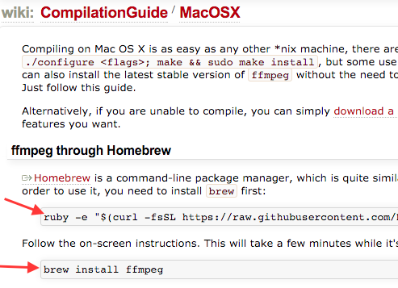

???
usually in the form of copy-pastable commands.

---

class: center
# `ffmpeg` Error


???

Sometimes the copy pasting would fail!

--
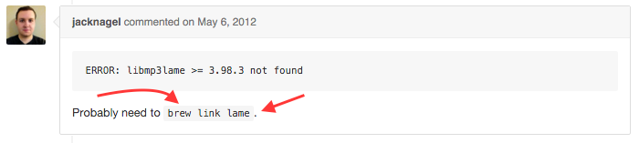

???

Rinse-repeat of google-copy-paste in order

Life was good! I got to run cool software, and I was the copy-paste queen.

---

template: copy-paste

---

name: frustration
template: copy-paste
copy-paste-class: past
disillusion-class: active

---

class: center
# Shared library conflict

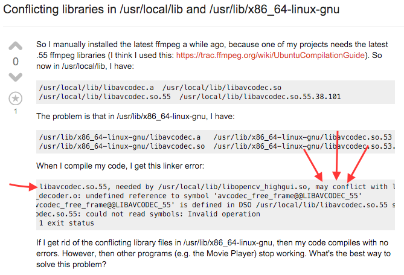

???

The more I copy-pasted, the more finicky my system got.

My strategy stopped working.

READMEs and Google couldn't handle my cluttered system.

Learned a lot, lost a lot. Excitement started to wane.

---

class: center
# Turned my back

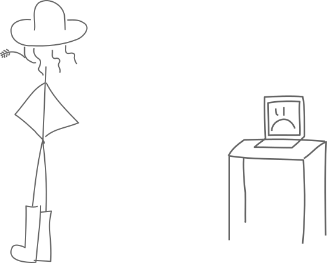

???

Until one hot summer day.... I fought my last battle.

I traded my upcoming career in computer science to go work on a farm.

---

name: farmer
template: map
copy-paste-class: past
disillusion-class: past
farmer-class: active
bright-eyed-class: ''
wise-class: ''
devops-class: ''
cards-class: ''
neat-freak-class: ''
whales-class: ''
question-class: ''

---

class: center
# Farmer


???

Rest for my beaten soul

---

class: center

# Despair
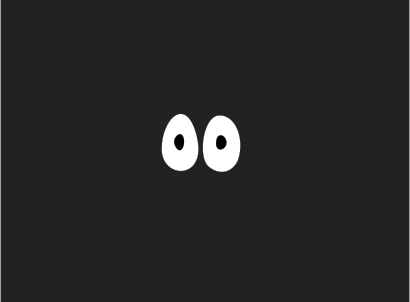

???

It was real. The dread of spending long hours fighting my system still
occasionally presses on my chest.

---

class: center
# Judgement


???

One selfish, illogical part of me wants to blame the project maintainers.

Who hide the complexity of installing their software behind a `configure`
command, or a sentence that says "You must install the ffmpeg shared library in
order to use this software."

Offloads the burden on to their users.

I know why they do it, but

beginners suffer the most.

---

class: center middle


???

But my journey doesn't stop on the farm.

I was about to learn some new things that would give me hope.

The world around was changing, osx package managers were getting better.

More importantly,

---

class: center
# New Job


???

new job means new development environment

I expected the worst. Much to my surprise....

---

class:center
# Setting up the FreshBooks Dev Image

--

.logo[]

???

Download a virtual machine image, boot it

--

```
puppet apply --test
```

???

Run this command

--

.icon[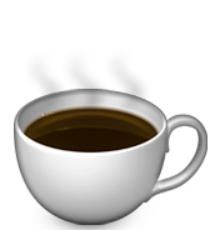]

???

Drink a cup of coffee

--
.icon[]

???

And end up with a working freshbooks.

---

name: bright-eyed
template: farmer
farmer-class: past
bright-eyed-class: active

---

# Elements of the FreshBooks Dev Image

1. Virtualization
1. Pre-built images
1. Configuration management

???

When I took a step back to deconstruct how it all worked,

---

# Foundation layer: Virtualization

--

* Runs a dedicated kernel, RAM

--
* Directly using CPU functionality

--
* Isolated from host-installed libraries

---

# Glue layer: Pre-built Machine Images

???

Virtualization not enough on its own.

A developer can't run `puppet agent --test` on a blank virtual machine and have
it work.

It needs an OS, and it needs to have puppet installed and configured.

--

* Bridge between blank virtual image and

    ```
    puppet agent --test
    ```

--
* Captures bootstrap work in a snapshot

--
* Known starting point for each developer

--


---

# Crowning glory: Config Management

--

* In this case: `puppet`

--
* Description files tell the config management program what to do
    * Downloads code
    * Installs dependencies
    * Connects services

--
* Key aspect: repeatable execution

---

# Infrastructure automation patterns

* Virtualization
* Pre-built machine images
* Configuration Management

---

name: wise
template: bright-eyed
bright-eyed-class: past
wise-class: active

---

# Snashpots README

image sharing website in PHP

## Installation

???

At FB, teaching a group of fledgling developers coding concepts.

Decided to do a PHP app together

I took pity on them and wrote the installation instructions

--
1. `git clone git@github.com:dev-quest/snashpots.git`

--

1. .icon[]

???

Apache on OSX is terrible

Took me forever to get the instructions right

But then they failed the first time someone from the group tried them out

---

# Some Sound Advice

* `vagrant` for setup
* `packer` for pre-built images

???

I didn't make the connection between this and the dev image I used every day.

These terms were new to me at the time.

I was going to learn a lot!

---

class: tight

# .icon[]

--

* Produces machine images

--
* According to JSON description files

--
* Just like code with code,

--
    * track changes
    * run tests
    * pinpoint bug origin

--

New pattern: Infrastructure as code!

---

# New Hammer. How to use?

--

* Whack all the things!

???

I could install the OS, apache, config, our code

--
    * Great at creating images, not great at maintaining

???

but then if the apache config needed updating,

I would need to create a new image which would have to be downloaded,

or they would have to make the change manually!

--
    * A poor choice for pushing out changes!

---

.icon[]

???

Had a hard time distinguishing between v and p at first

--

> Create and configure lightweight, reproducible, and portable
development environments

???

Packer makes claims about reproducibility around creating machines

--

> Create a single file for your project to describe the type of
machine that you want, the software that needs to be installed.

???

Sounds like Infra-as-code!

--

> Store this file with your project code.

I can do that with packer code... so?

---

class: center middle

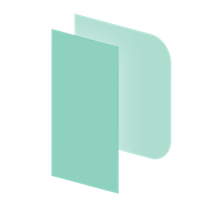 vs 

???

Only by playing with vagrant was I able to make the distinction.

---

# Vagrant: development-centric

--

* Checked-in Vagrantfile: dev image evolves lock-step with code

--
* Apply latest configuration:

    ```
    vagrant provision
    ```

--
* Configure network, mount filesystem:

    ```
    vagrant up
    ```

--
* Live debugging:

    ```
    vagrant ssh
    ```

---

# Packer vs Vagrant

* Both automate creation and provisioning
* Packer is about static imags
* Vagrant is about living, breathing, running code

---

# Packer + Vagrant = .icon[]

--

Holy Grail of Development

???

Freeing devs from the ancillary task of coaxing dependencies into submission,

it was a changing force in our industry.

---

# "Works on my machine"

Sadly still a thing between devs and sysadmins :(

--

Production and Development environment still too different.

--

Why is that?

???

What if we tried to apply the patterns learned so far, such as

* virtualization
* infrastructure as code

I learned part of the answer on a new team I joined at FreshBooks.

---

name: devops
template: wise
wise-class: past
devops-class: active

---

# Team Morpheus

A production-like staging environment

A production-like dev environment?

---

# `vagrant up freshbooks`

Vagrant for service-oriented architectures:

--

```
$ vagrant up \
    front-end-01 \
    back-end-01 \
    database-01 \
    rabbit-mq-01 \
    auth-01 \
    loadbalancer-01 \
    ...
```

--

```
Error: Out of memory!
```

---

class: center
# Virtualization Overhead

.med-image[
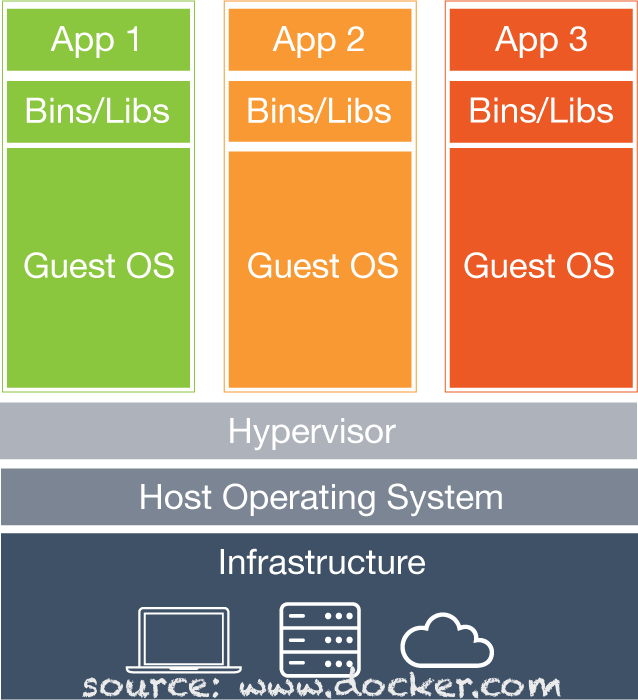]

---

# Containers on the rise

--

.logo[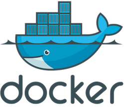] .logo[] .logo[]

---

class: center

# PagerDuty


---

# PagerDuty Dev-Image

Premise: Production-like, but light-weight

Replace "Virtualization" pattern with "Containerization"

Use production config management (`chef` recipes, in this case) to build
production-like containers

???

My team was trying to build a production-like dev image, only this time...

---

class: center
# Containers Overhead

.med-image[
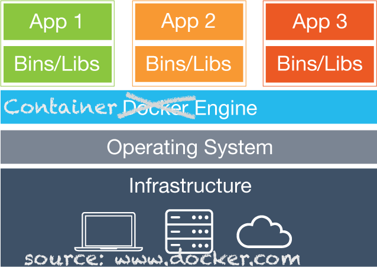]

???

- the semblance of OS, filesystem and process space to itself
- shares its ram and kernel with the host os and other containers
- 1 service or 12, a production environment seemed ripe for the taking

---

class: center
# Config Management

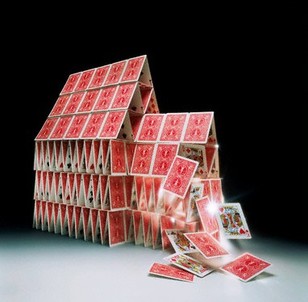

???

Yet we struggled

---

# Config Management Dependencies

--
* Secrets

--
* Internet

--
* External servers

--
* Pre-existing infrastructure

---

name: cards
template: devops
devops-class: past
cards-class: active

---

# Our Dev-Image is Touchy!

* Sensitive to any `chef` change
* Very order dependent
* Basically: fragile

Like production, our dev-image made too many assumptions about the world

???

Great for testing chef recipes,

but developers wouldn't touch it for developing code.

---

name: neat
template: cards
cards-class: past
neat-freak-class: active

---

class: center
# Kitchen Sink Container


???

Small detour!

Friend who abhorred installing stuff on his host

* node, bower, ember
* java

The Dockerfile (simple file used to describe how to create and run a docker
container) grew to 260 lines and 2.5G. GIANT

I was inspired! Why was I inspired?

---

name: whales
template: neat
neat-freak-class: past
whales-class: active

---

class: tight
# Docker is Infrastructure As Code

--

* Dockerfile syntax:

    ```dockerfile
    FROM python:alpine
    RUN echo 'hi!' > hello.txt
    CMD python -m http.server
    ```

--
* `docker-compose.yml` coordinates between services:

    ```yml
    db:
      image: postgres
    rails:
      build: .
      volumes: .:/usr/src/app
      working_dir: /usr/src/app
      command: bundle exec rails server
      link: db
    ```

???

These files are relatively easy to write and maintain for a given project.

They can evolve with the code like a Vagrantfile.

But containers are so lightweight.

---

# Pre-built Images and Docker

```bash
docker build -t my-container .
docker push my-container

# later:

docker pull my-container
```

---

# Docker's Patterns

.icon[] Containerization

.icon[] Pre-built images

.icon[] Infrastructure as code

---

# Such hammer, many dockers

* Everything began to look like a nail
    * bundler
    * golang
    * python

---

# Back to my Team

Decided to give Docker a try, this time prioritizing dev over prod.

This move has yet to play out. Not all fun and games!

May achieve prod-dev parity yet.

???

I'm just happy I eased some people's pain.

---

name: ?
template: whales
whales-class: past
question-class: active

???

Here we are, wherever that is. We've caught up to my present.

---

# Parting thought

> "A thriving project is more than a pile of code. It’s the packaging,
explanation, outreach, and empathy of maintainers that make a good project
great."

> &mdash; Joe Nelson, @begriffs, from [a great blog
> post](http://begriffs.com/posts/2016-01-29-making-twenty-percent-time-work.html)

--

* We have no more excuses!

--
* Project creators, help everyone out with installation pain!

--
* Beginners, you are not alone, and there is hope.

---

# `whoami`

Marguerite des Trois Maisons

`des4maisons`

- github
- twitter
- freenode
- foonetic

---

# Resources


* Slides made in [Remark.js](https://github.com/gnab/remark)
* Images made in [Inkscape](https://inkscape.org/)
* [www.virtualbox.org](https://www.virtualbox.org/)
* [www.vagrantup.com](https://www.vagrantup.com/)
* [www.packer.io](https://www.packer.io/)
* [www.docker.com](https://www.docker.com/)
* [Kitchen Sink Docker Development Environment](https://github.com/marvinpinto/kitchensink)

